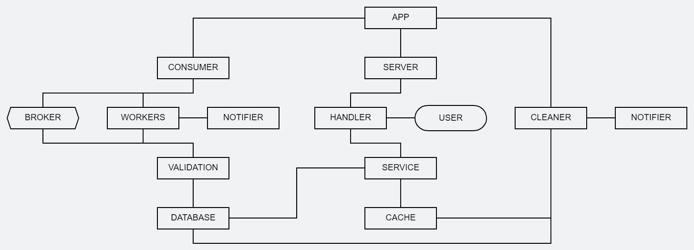

<h1>

<h3 align="center">Go-based fault-tolerant web service that processes orders from Kafka, saves them in PostgreSQL, and provides fast in-memory retrieval over HTTP.</h3>

<p align="center">
  <a href="https://pkg.go.dev/github.com/Pur1st2EpicONE/WBTECH-sample-microservice">
    
  </a>
  <a href="https://goreportcard.com/report/github.com/Pur1st2EpicONE/WBTECH-sample-microservice">
    
  </a>
  
</p>
<br>
<br>
<br>

# The easy way

You can actually just watch this cool video I made about the service's workflow. It describes the installation and main features of the project. After watching it, you might not even need the rest of this page.

[](https://www.youtube.com/watch?v=MKMquUqmJzM)

<br>

# I have no eyes and I must read
Suit yourself.

<br>

## Table of Contents

1. [Architecture and key features](#architecture-and-key-features)
2. [Installation](#installation)
3. [Producing orders](#producing-orders)
4. [Retrieving orders](#retrieving-orders)
5. [Configuration](#configuration)
6. [Running tests](#running-tests)
7. [Shutting down](#shutting-down)

<br>

## Architecture and key features

### Architecture
The project architecture strikes a balance between simplicity and clarity. The service is organized around three main entities: Consumer, Server, and Cleaner.

- Consumer — a composite component that manages interaction with the message broker. It launches workers, monitors broker availability, handles worker panics, and performs a variety of other essential tasks.

- Server — the core of the business logic exposed to users. It processes incoming requests, fetches orders, and returns responses.

- Cleaner — a background service responsible for cache cleanup based on TTL. Since the cache is implemented as a ring buffer, the cleaner serves as an additional mechanism to keep cached orders fresh.

At the top of the hierarchy is the App — the central orchestrator. It initializes the application and coordinates the high-level operations that tie everything together.

The following diagram illustrates the overall service structure:



### Key features

#### Extensive configuration
A highly flexible configuration system: everything can be tuned from a single place, from log file paths to message compression levels in the DLQ.

#### Modular design
The entire project is built around interfaces, making components easily interchangeable.

#### Cache cleaner
Background cache cleaner that ensures fresh data by removing expired entries.

#### Graceful degradation (read-only fallback)

The service prioritizes read availability and remains usable even when multiple core components fail at once.

- Database outage: the service temporarily stops saving new orders to the database and cache eviction is suspended; existing cached orders continue to be served.

- Message broker outage: workers retry N times with backoff; if retries are exhausted they exit. With restarts enabled, the consumer respawns them after a cooldown.

- Combined failures: even if both the consumer and the database are down, the HTTP server keeps serving orders from the cache. What a hero.

#### Critical notifications
A flexible interface-based notification system:

- Database failures trigger alerts from both workers and the cleaner.

- Message broker failures trigger critical alerts from workers before they panic.

#### Multi-level validation

Validation is performed at several stages:

- JSON unmarshalling errors.

- Structural validation using a dedicated validation package.

- SQL-level validation (e.g., NOT NULL constraints).

#### End-to-end delivery guarantees

- Database operations use transactions.

- Kafka offsets are committed manually only after successful database write.

- Failed inserts result in the message being redirected to the DLQ.

#### Structured logging

- All logs are consistent across the service, formatted in JSON.

- Key fields are always included (e.g., workerID, orderUID, layer) for easy filtering and parsing.

- Messages are structured yet human-friendly, making manual inspection straightforward.

- A debug mode can be enabled to log every internal operation for deep inspection.

#### Ingenious frontend design

Nuff said.

<br>

## Installation
⚠️ Prerequisite:
This project requires Docker Compose, regardless of how you choose to run it.  

First, clone the repository and enter the project folder:

```bash
git clone https://github.com/Pur1st2EpicONE/WBTECH-sample-microservice.git
cd WBTECH-sample-microservice
```
Then you have two options:

#### 1. Run everything in containers
```bash
make
```

This will start the entire project fully containerized using Docker Compose.

#### 2. Run wb-service locally
```bash
make local
```
In this mode, only PostgreSQL and Kafka are started in containers via Docker Compose, while the application itself runs locally.

⚠️ Note:
Local mode requires Go 1.24.5 and the latest version of the migrate CLI tool installed on your machine.

<br>

## Producing orders

Before retrieving orders through the API, you first need to populate the database.  
To do this, send some test orders to Kafka. There are two ways to do it:

#### 1. Using the Makefile command
```bash
make orders # full docker setup  
-------------------------------
make local-orders # local setup
```
#### 2. Sending a specific number of orders
```bash
docker exec wb-service ./producer <number_of_orders> # full docker setup
------------------------------------------------------------------------
go run ./cmd/producer/ <number_of_orders> # local setup
```
You can also send a bad order (i.e., an order that fails validation and will be sent to the DLQ) by running:
```bash
make bad order # full docker setup
----------------------------------
make local-bad-order # local setup
```

<br>

## Retrieving orders

There are two ways to fetch an order: via API or through a browser.

### Using the API
Send a `GET` request to the following endpoint:

```bash
/api/v1/orders/<order_uid>
```
Here's an example using curl:

⚠️ Note that the order_uid can be found in the terminal output after running one of the order-producing commands.

### Using a Browser

Simply open your browser at localhost:8081, enter the order_uid in the search form, and click Search.

<br>

## Configuration

If you want to customize the setup, check the configuration files in the configs folder. There are two .yaml files:

- config.dev.yaml – local setup

- config.full.yaml – full docker setup 

Each file contains settings for the app, server, database, Kafka, cache, and notifier. For example:

- Logging is enabled in debug mode by default and logs are written to ./logs.

- The cache cleaner is enabled and will periodically clean up expired orders.

- Database and Kafka connections are preconfigured for either local or containerized environments.

You can adjust any values to match your setup, such as server port, cache size, number of consumer workers, or API timeouts. Changes will take effect on the next service start.

<br>

## Running tests

At this moment, the service supports only local testing.
This means that all conditions for the local setup (make local) must be met before running tests.

### Unit tests
```bash
make test-unit
```

### All tests (unit + integration)
```bash
make test
```

Upon completion, an HTML coverage report will be generated in the project root.

<br>

## Shutting down

How you stop the service varies depending on your setup:

### Local setup

Press Ctrl+C to send SIGINT to the application.
You can observe the graceful shutdown process in the logs.
Once the application has stopped, run:
```bash
make local-down
```

### Full Docker setup

Simply run:
```bash
make down
```
⚠️ Note: In the full Docker setup, the log folder will not be removed automatically because it’s created by the container as root. To delete it manually, run:
```bash
sudo rm -rf <log-folder>
```
