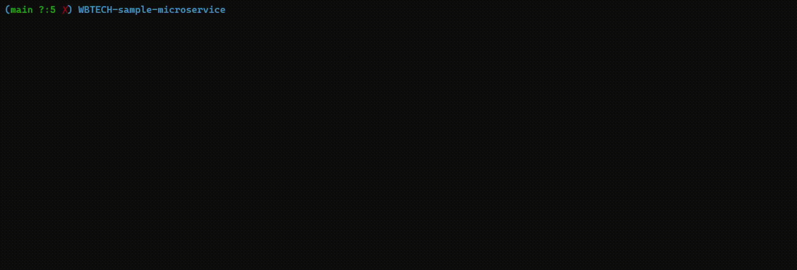

<h1>

<h3 align="center">Go-based fault-tolerant web service that processes orders from Kafka, saves them in PostgreSQL, and provides fast in-memory retrieval over HTTP.</h3>

<p align="center">
  <a href="https://pkg.go.dev/github.com/Pur1st2EpicONE/WBTECH-sample-microservice">
    
  </a>
  <a href="https://goreportcard.com/report/github.com/Pur1st2EpicONE/WBTECH-sample-microservice">
    
  </a>
  
</p>
<br>
<br>
<br>

# The easy way

### You can actually just watch this cool video I made about the service's workflow. It describes the installation and main features of the project. After watching it, you might not even need the rest of this page.

[](https://www.youtube.com/watch?v=MKMquUqmJzM)

<br>

# I have no eyes and I must read

<br>

## Getting Started
⚠️ Prerequisite:
This project requires Docker Compose, regardless of how you choose to run it.  

First, clone the repository and enter the project folder:

```bash
git clone https://github.com/Pur1st2EpicONE/WBTECH-sample-microservice.git
cd WBTECH-sample-microservice
```
Then you have two options:

#### 1. Run everything in containers
```bash
make
```

This will start the entire project fully containerized using Docker Compose.

#### 2. Run wb-service locally
```bash
make local
```
In this mode, only PostgreSQL and Kafka are started in containers via Docker Compose, while the application itself runs locally.

⚠️ Note:
Local mode requires Go 1.24.5 and the latest version of the migrate CLI tool installed on your machine.

<br>

## Producing orders

Before retrieving orders through the API, you first need to populate the database.  
To do this, send some test orders to Kafka. There are two ways to do it:

#### 1. Using the Makefile command
```bash
make orders # full docker setup  
-------------------------------
make local-orders # local setup
```
#### 2. Sending a specific number of orders
```bash
docker exec wb-service ./producer <number_of_orders> # full docker setup
------------------------------------------------------------------------
go run ./cmd/producer/ <number_of_orders> # local setup
```
You can also send a bad order (i.e., an order that fails validation and will be sent to the DLQ) by running:
```bash
make bad order # full docker setup
----------------------------------
make local-bad-order # local setup
```

<br>

## Retrieving Orders

There are two ways to fetch an order: via API or through a browser.

### Using the API
Send a `GET` request to the following URL:

```bash
localhost:8081/api/v1/orders/<order_uid>
```

⚠️ Note that the order_uid can be found in the terminal output after running one of the order-producing commands.

### Using a Browser

Simply open your browser at localhost:8081, enter the order_uid in the search form, and click Search.
